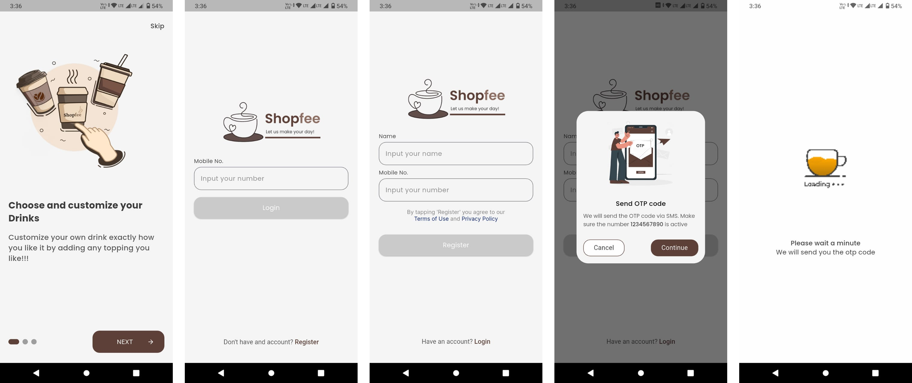
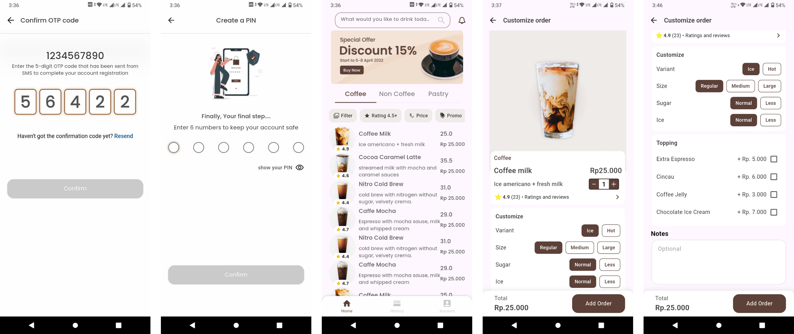
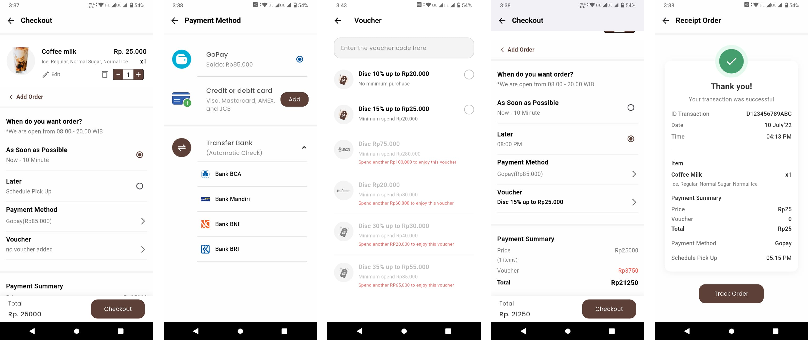
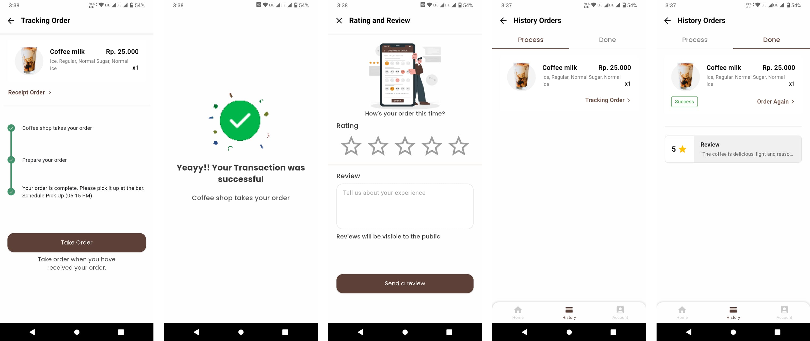

# ☕ Coffee Shop - Premium Mobile Ordering App


**Coffee Shop** is a modern and sleek mobile application engineered to deliver a seamless and premium coffee ordering experience. Built with **Flutter**, this project adheres to **Clean Architecture** principles and **Clean Code** best practices, ensuring a codebase that is as elegant as the UI it powers.

Manage your orders, customize your brews, and enjoy a fluid, animated interface designed for modern mobile standards.

---

## ✨ Features

Experience a robust feature set crafted for performance and usability:

*   🔐 **Secure Authentication**
    *   OTP-based Login & Signup flow.
    *   Secure session management.
*   🛤️ **Immersive Onboarding**
    *   Smooth, animated onboarding screens introducing app features.
*   🛍️ **Smart Poduct Discovery**
    *   **Dynamic Carousels**: Highlight featured beverages.
    *   **Category Filtering**: "Pills" based filtering for Coffee, Non-Coffee, Pastries, etc.
    *   **Search**: Instant product search capability.
*   📝 **Detailed Product Customization**
    *   Rich product imagery and descriptions.
    *   Customization options (Size, Sugar, Ice, Toppings).
*   🛒 **Advanced Cart & Checkout**
    *   Real-time cart updates.
    *   Voucher/Discount code application.
    *   Multiple payment method support.
*   📦 **Live Order Tracking**
    *   Visual timeline of order status (Preparing -> Ready -> Delivered).
*   📜 **Comprehensive History**
    *   Detailed transaction logs and past order reviews.
*   ⭐ **Interactive Ratings**
    *   User feedback system with star ratings and reviews.
*   🎨 **Premium UI/UX**
    *   **Responsive Design**: Pixel-perfect adaptation to any screen size using `flutter_screenutil`.
    *   **Micro-interactions**: Subtle animations for button presses, transitions, and loading states.

---

## 📸 Screenshots

<p align="center">
  
  <br><br>
  
  <br><br>
  
  <br><br>
  
</p>

---


## 🎨 Design & Inspiration

This project is a high-fidelity implementation based on a **Figma Community** prototype.

> [!NOTE]
> **From Prototype to Product**: This project demonstrates the capability to take a conceptual design (with its inherent limitations) and translate it into a functional, premium mobile application.
> 
> *   **Faithful Adaptation**: The UI matches the original creative vision pixel-for-pixel.
> *   **Future-Ready**: While initially structured to match the prototype's static nature, the underlying **Clean Architecture** ensures the app is ready to become fully dynamic and server-driven in upcoming updates.

## 🛠️ Tech Stack & Architecture

This project is built on a foundation of **Clean Architecture**, promoting separation of concerns and testability.

### **Core Framework**
*   **Flutter**: UI Toolkit for building natively compiled applications.
*   **Dart**: Optimized usage for UI construction.

### **Architecture Highlights**
The codebase is organized by **Feature** and **Layer**, ensuring that UI, Logic, and Data are decoupled:
*   **`presentation/`**: Contains UI logic, Widgets, and Screens (Authentication, Home, Checkout, etc.).
*   **`model/`**: Pure data classes defining the shape of domain entities (Products, Transactions).
*   **`items/` & `custom_widgets/`**: Reusable component library for consistent design interpretation.
*   **`constants/`**: Centralized configuration for assets, strings, and styles.

### **Key Libraries**
*   **UI & Styling**:
    *   `flutter_screenutil`: Responsive sizing.
    *   `google_fonts`: Premium typography.
    *   `flutter_svg`: Vector graphic support.
*   **Components**:
    *   `carousel_slider`: Feature banners.
    *   `pin_code_fields`: OTP input handling.
    *   `timeline_tile`: Order tracking visualization.
    *   `flutter_rating_bar`: Star rating interactions.
*   **Storage**:
    *   `shared_preferences`: Local persistent storage for user sessions.

---

## 📂 Project Structure

A glimpse into the organized file structure of the project:

```
lib/
├── constants/         # App-wide constants (Colors, Strings)
├── model/             # Data models (Product, User, Cart)
├── product/           # Product-related components
├── presentation/      # UI Layer organized by Feature
│   ├── authentication/
│   ├── home/
│   ├── checkout/
│   ├── payment/
│   ├── track_order/
│   └── custom_widgets/
└── main.dart          # Application Entry Point
```

---

## 🚀 Getting Started

Follow these steps to set up the project locally.

### Prerequisites
*   **Flutter SDK**: [Install Flutter](https://flutter.dev/docs/get-started/install)
*   **Dart SDK**: Included with Flutter.
*   **IDE**: VS Code or Android Studio.

### Installation

1.  **Clone the repository**
    ```bash
    git clone https://github.com/milanrnw/coffee_shop.git
    cd coffee_shop
    ```

2.  **Install Dependencies**
    ```bash
    flutter pub get
    ```

3.  **Run the Application**
    Connect a physical device or start an emulator.
    ```bash
    flutter run
    ```

---

## 🤝 Contributing

Contributions are welcome! If you see an opportunity to improve the code or add a feature:

1.  Fork the repository.
2.  Create your feature branch (`git checkout -b feature/AmazingFeature`).
3.  Commit your changes (`git commit -m 'Add some AmazingFeature'`).
4.  Push to the branch (`git push origin feature/AmazingFeature`).
5.  Open a Pull Request.

---

## 📄 License

This project is licensed under the MIT License - see the [LICENSE](LICENSE) file for details.
